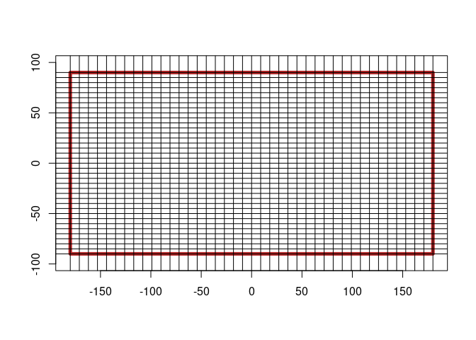

<!-- README.md is generated from README.Rmd. Please edit that file -->

# vaster

<!-- badges: start -->

[](https://github.com/hypertidy/vaster/actions/workflows/R-CMD-check.yaml)
<!-- badges: end -->

The goal of vaster is to provide grid logic without complication added
by data and format details.

## Installation

You can install the development version of vaster from
[GitHub](https://github.com/) with:

``` r
# install.packages("devtools")
devtools::install_github("hypertidy/vaster")
```

See?

``` r
library(vaster)
set.seed(1)
x <- c(sort(runif(2, -20, 160)), sort(runif(2, -80, 10)))
names(x) <- c("xmin", "xmax", "ymin", "ymax")
print(x)
#>       xmin       xmax       ymin       ymax 
#>  27.791559  46.982302 -28.443197   1.738701
## all we need is a extent and dimension, we want to align to that grid
v <- vcrop(x,  c(360, 180) /3, extent = c(-180, 180, -90, 90))
plot(NA, xlim = v$extent[1:2], ylim = v$extent[3:4], asp = "")
g_along <- function(x, n) seq(x[1], x[2], length.out = n)
abline(v = v$extent[1:2], h = v$extent[3:4], lwd = 2)
abline(v = g_along(v$extent[1:2], v$dimension[1]), h = g_along(v$extent[3:4], v$dimension[2]), col = "grey")

## these points were used to crop the existing grid, they don't define its alignment
points(x[1:2], x[3:4], pch = "+")
```


All of the helper functions from the raster package are included, and
every function is one of dimension, extent (when needed) in that order.

A grid of the world in 9x5 degree squares, we only need the dimension
and extent to get the corners in x, y.

``` r
ex <- c(-180, 180, -90, 90)
dm <- c(40, 36)

plot_extent(ex)
abline(v = x_corner(dm, ex), h = y_corner(dm, ex))
```



Now add the centre points.

``` r
plot_extent(ex)
points(x_centre(dm, ex), rep(y_centre(dm, ex)[1], length.out = dm[1]))
```


We only get the margins from x_corner/x_centre so we go to a cell based
function.

``` r
## how many cells?
cells <- seq_len(prod(dm))
plot_extent(ex)
points(xy_from_cell(dm, ex, cells))
```


Other functions return cells.

``` r
xy <- cbind(runif(50, -180, 180), runif(50, -90, 90))
cells <- cell_from_xy(dm, ex, xy)
plot_extent(ex)
points(xy_from_cell(dm, ex, cells), col = "red")
points(xy, pch = "+")
```


## Code of Conduct

Please note that the vaster project is released with a [Contributor Code
of
Conduct](https://contributor-covenant.org/version/2/1/CODE_OF_CONDUCT.html).
By contributing to this project, you agree to abide by its terms.
